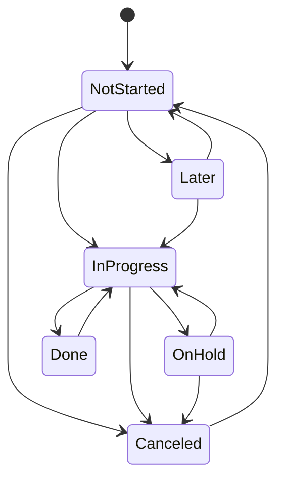

# QUMC Projects PMS Replacement - Business Requirements Document

**Organization:** Qassim University Medical City (QUMC)  
**Document Type:** Business Requirements Document (BRD)  
**Target Product:** QUMC Projects Project Management System (PMS)  
**Target Platform:** ASP.NET Core 9 MVC, EF Core 9, SQL Server, Razor Views  
**Prepared Date:** 2026-06-30  
**Primary Source:** Notion workspace "Qumc Projects"  

---

## 1. Executive Summary

- QUMC currently uses a Notion workspace named **Qumc Projects** as a lightweight internal PMS for project inventory, task tracking, member assignment, sprint linkage, logs, and project documentation.
- The business goal is to replace the Notion PMS with a self-hosted ASP.NET Core MVC application that follows QUMC development standards, uses SQL Server for structured data, and integrates with QUMC authentication and permission practices.
- The replacement system must preserve the current workspace behavior that matters most: project portfolio management, task lifecycle tracking, per-member work views, project/task relationships, sprint/backlog separation, central incident/log tracking, and migration of important Notion content.
- The new PMS is not intended to rebuild QUMC business applications such as Myserv, Academic Training, OVR, HR, Dental, or Telephone Directory. Those applications are portfolio records managed by the PMS.
- The recommended MVP is a single ASP.NET Core 9 MVC web application with area-based modules, EF Core 9, SQL Server, ADFS/Azure AD authentication, QUMC permission integration, bilingual-ready UI, and controlled migration from Notion.

---

## 2. Current State

### 2.1 Current Notion Workspace

The Notion root page **Qumc Projects** contains the operational workspace for the PMS. It includes:

- Members database
- Qumc Projects database
- Tasks database
- Central Log database
- Sprints database
- PMS Replacement discovery prompt

### 2.2 Current Project Database

The **Qumc Projects** database is the portfolio registry. It stores project records and supports ownership, project hierarchy, and priority weighting.

Observed fields:

| Field | Current Notion Type | Business Meaning |
|---|---|---|
| Project Name | Title | Project or system name |
| Members | Relation to Members | Assigned owner(s) or contributors |
| Parent Project | Self-relation, multiple | Related parent projects or grouped systems |
| Parent item | Self-relation, single | Direct parent record |
| Sub-item | Self-relation | Child projects or sub-projects |
| weight(1-10) | Number | Priority, importance, or ordering weight |
| note | Text | Free-form project note |

Observed project examples include:

- Myserv
- OPD
- HR
- Dental
- Telephone Directory
- Quality
- OVR
- Logger
- Organization Structure
- Academic Training
- Coop
- Assignment
- ShortCut
- EmployeeVoice
- API
- IT
- SupportServices
- TeleMedicine
- WorkAssignment

### 2.3 Current Tasks Database

The **Tasks** database is the active work tracker. It links tasks to projects, members, and sprints.

Observed fields:

| Field | Current Notion Type | Business Meaning |
|---|---|---|
| Task Name | Title | Task title |
| done | Status | Task lifecycle state |
| Stage | Select | sprint or backLog |
| Member | Relation to Members | Assigned task member(s) |
| Qumc Projects | Relation to Projects | Parent project |
| sprints | Relation to Sprints | Sprint assignment |
| Estimated Date | Date | Target completion date |
| started on | Date | Actual start date |
| finished on | Date | Actual finish date |
| Over Due | Formula | Computed overdue indicator |
| project member | Rollup | Member inherited from parent project |
| Created time | System field | Creation timestamp |
| Last edited time | System field | Update timestamp |

Observed task statuses:

- Not started
- Later
- On hold
- In progress
- Done
- Canceled

Observed task views:

- Pending tasks: To-do and In progress status groups
- Show All
- Directed Tasks: tasks with an assigned member
- Project Tasks: tasks linked to a project
- Last edit: sorted by last edited time
- Per-member views: Sultan, Haitham, Muhannad, Adeebah, Reem, Raghad
- Pending all

### 2.4 Current Members Database

The **Members** database represents team members used for project and task assignment.

Observed fields:

| Field | Current Notion Type | Business Meaning |
|---|---|---|
| Member Name | Title | Team member display name |
| Status | Status | Member work/status marker |
| Date | Date | Related date marker |

Observed member examples:

- Sultan
- Muhannad
- Adeebah
- Reem
- Haitham
- Raghad

### 2.5 Current Sprints Database

The **Sprints** database provides sprint grouping for tasks.

Observed fields:

| Field | Current Notion Type | Business Meaning |
|---|---|---|
| Name | Title | Sprint name |
| started on | Date | Sprint start date |

### 2.6 Current Central Log Database

The **Central Log** database captures notable operational events, incidents, or decisions.

Observed fields:

| Field | Current Notion Type | Business Meaning |
|---|---|---|
| Name | Title | Log title |
| Effect Level | Select | Impact severity: High, Med, Low |
| incdent time | Date | Incident/event date and time |
| Created by | System field | Creator |
| Created time | System field | Creation timestamp |

### 2.7 Current Notion Content Pages

Individual project pages often include:

- Database Name
- Daily Progress
- Project Description
- Github Link
- Inline Publish History database
- Additional detail pages or embedded databases

Examples observed:

- **Myserv:** QUMC service portal with many internal service modules such as Active Directory, OPD links, permissions, employee information, HIS account requests, SMS, HR approvals, and external systems.
- **Academic Training:** Course registration and payment system with Moyasar payment integration, course management, trainer management, target audience management, QR code generation, email/SMS notifications, and payment verification.
- **OVR:** Occurrence Variance Report system for recording and analyzing unexpected healthcare events, medical errors, injuries, and patient safety events.
- **OPD:** Clinic closure scheduling system for outpatient clinics.
- **Telephone Directory:** Internal contact directory searchable by name, job, department, or extension.
- **EmployeeVoice:** Complaint and suggestion management system with Admin, HR Members, and employee workflows.

---

## 3. Business Goals

### 3.1 Primary Goals

- Replace Notion as the operational PMS for QUMC software and internal systems work.
- Provide a structured, searchable, permission-controlled project portfolio.
- Track project tasks from backlog to completion with assignment, dates, status, and sprint linkage.
- Support team-specific and member-specific views similar to the existing Notion workspace.
- Preserve migration-critical Notion data, project descriptions, and source references.
- Align with QUMC ASP.NET Core MVC standards and authentication/authorization patterns.

### 3.2 Secondary Goals

- Improve reporting, dashboarding, and auditability beyond current Notion tables.
- Reduce dependency on manual Notion views by implementing saved filters and role-aware dashboards.
- Provide a foundation for future enhancements such as comments, attachments, notifications, and richer release tracking.

### 3.3 Success Measures

- All active projects, members, sprints, central logs, and tasks can be migrated from Notion into SQL Server.
- Users can view the same core work lists currently represented by Notion views.
- Each user can quickly see assigned tasks, pending work, overdue work, and project ownership.
- Admins can manage projects, tasks, members, sprints, and logs without Notion.
- Stakeholders can use the system for at least one full sprint without returning to Notion for daily PMS work.

---

## 4. Scope

### 4.1 In Scope

- Project portfolio management
- Project hierarchy and relationships
- Project owner/member assignment
- Project notes, descriptions, links, and migrated page content
- Task tracking
- Task lifecycle and status rules
- Sprint and backlog management
- Member management
- Central log management
- Dashboards and saved filtered views
- Role-based access control
- Basic notifications for assignment, overdue tasks, and status changes
- Audit history for important changes
- Notion data migration and read-only archive strategy
- Reporting and export requirements

### 4.2 Out of Scope

- Rebuilding every application listed in Qumc Projects.
- Replacing GitHub, deployment tooling, or source control.
- Building a SPA, Blazor app, or separate frontend.
- Real-time Notion-style collaborative editing in v1.
- Full clone of Notion pages, blocks, embeds, templates, AI features, or semantic search.
- Organization-wide enterprise project portfolio management beyond the QUMC development team's current PMS needs.

### 4.3 Scope Assumptions

- [ASSUMPTION] The PMS will be used primarily by the QUMC development team and selected stakeholders.
- [ASSUMPTION] The listed QUMC systems are portfolio items, not applications to be rebuilt inside the PMS.
- [ASSUMPTION] The initial release should preserve core PMS workflows before attempting Notion-like rich collaboration features.
- [ASSUMPTION] Notion will remain available as a read-only archive during migration validation and early production use.

---

## 5. Stakeholders and Users

### 5.1 Stakeholders

| Stakeholder | Interest |
|---|---|
| Project Owner / Tech Lead | Visibility, assignment, prioritization, delivery tracking |
| Developers | Personal task list, sprint/backlog clarity, project context |
| QUMC IT / Development Management | Portfolio overview, reporting, accountability |
| Business Owners | Status visibility for their related systems |
| System Administrator | User, permission, data, and configuration management |

### 5.2 User Roles

| Role | Description |
|---|---|
| Admin | Full system configuration and all data management |
| Tech Lead | Project planning, assignment, prioritization, sprint control, reporting |
| Developer | Work on assigned tasks, update status, add notes/logs |
| Viewer / Stakeholder | Read-only visibility into allowed projects and reports |
| Migration Admin | Import, validate, and reconcile Notion data |

---

## 6. Functional Requirements

### 6.1 Project Portfolio Module

The system shall provide CRUD operations for QUMC project records.

Requirements:

- Create, update, view, archive, and restore projects.
- Store project name, description, database/system name, note, weight/priority, links, owner members, and status.
- Support project hierarchy using parent/child relationships.
- Support multiple related parent projects where needed.
- Display child projects and related projects on the project detail page.
- Show task summary per project: total, pending, in progress, done, canceled, overdue.
- Preserve migrated Notion page descriptions and source URLs.
- Support project filters by member, status, priority, parent project, and keyword.
- Support sorting by weight/priority, project name, last updated, and owner.

### 6.2 Task Management Module

The system shall provide task lifecycle management linked to projects and members.

Requirements:

- Create, update, view, assign, archive, and restore tasks.
- Link each task to zero or more projects.
- Assign each task to zero or more members.
- Link each task to zero or more sprints.
- Track estimated date, started on, finished on, created at, updated at, and status.
- Calculate overdue status from estimated date and completion status.
- Support stage values: sprint and backLog.
- Support status values: Not started, Later, On hold, In progress, Done, Canceled.
- Provide pending task views matching current Notion behavior.
- Provide per-member task lists.
- Provide project task lists.
- Provide recently edited task view.
- Allow task notes and optional rich text in v1 if feasible.

### 6.3 Sprint Management Module

The system shall provide sprint grouping for tasks.

Requirements:

- Create, update, view, close, and archive sprints.
- Store sprint name, start date, optional end date, and status.
- Assign tasks to sprints.
- Show sprint board/list with tasks grouped by status.
- Show sprint summary: total tasks, completed tasks, pending tasks, overdue tasks.
- Allow moving tasks between backlog and sprint.

### 6.4 Member Management Module

The system shall provide a member registry for assignment and reporting.

Requirements:

- Create, update, view, activate, deactivate, and archive member records.
- Store member display name, email, status, optional employee number, and linked QUMC identity.
- Link members to projects and tasks.
- Show each member's active projects, active tasks, overdue tasks, and completed task count.
- Preserve current member names from Notion during migration.

### 6.5 Central Log Module

The system shall provide a central log for important operational notes, incidents, and decisions.

Requirements:

- Create, update, view, and archive central log entries.
- Store title, effect level, incident/event time, description, created by, and created time.
- Support effect levels: High, Med, Low.
- Allow linking a log entry to projects and/or tasks.
- Provide filters by effect level, date range, project, creator, and keyword.

### 6.6 Project Detail and Knowledge Capture

The system shall preserve essential Notion project page content.

Requirements:

- Each project shall have a detail page containing migrated sections such as Database Name, Project Description, Github Link, and Publish History.
- Project detail pages shall support structured fields first, with optional long-form description content.
- Links to GitHub, deployed systems, documentation, and Notion source pages shall be supported.
- Publish History shall be represented as structured records when data is available; otherwise it shall be stored as migrated reference content.

### 6.7 Dashboards and Views

The system shall replace core Notion views with MVC dashboards and saved filters.

Required views:

- All projects
- Projects grouped by member
- Projects sorted by weight
- All tasks
- Pending tasks
- Directed tasks
- Project tasks
- Last edited tasks
- Per-member task lists
- Sprint tasks
- Overdue tasks
- Central logs by effect level

Requirements:

- Filters shall be represented using query strings and optional saved user filters.
- Users shall be able to bookmark filtered views.
- The system shall provide a home dashboard personalized by current user.
- Admins and Tech Leads shall have portfolio dashboards.

### 6.8 Search

The system shall provide keyword search across core PMS records.

Requirements:

- Search projects by name, description, note, database name, and links.
- Search tasks by title and notes.
- Search central logs by title and description.
- Support filters with search results.
- [GAP] Notion semantic search and AI search are not required in v1.

### 6.9 Notifications

The system shall provide basic notifications for workflow events.

Requirements:

- Notify assigned members when a task is created or assigned.
- Notify assigned members when task due date changes.
- Notify Tech Lead/Admin for overdue tasks.
- Notify relevant users when important central logs are created.
- Support email notifications using QUMC email patterns where feasible.
- [ASSUMPTION] In-app notifications can be deferred if email notifications satisfy MVP needs.

### 6.10 Reporting and Export

The system shall provide operational reports for management and team review.

Reports:

- Project portfolio summary
- Project status report
- Member workload report
- Sprint summary report
- Overdue tasks report
- Central log impact report
- Migration reconciliation report

Export requirements:

- Export lists to Excel where operationally useful.
- Export key reports to PDF if required by stakeholders.
- Maintain filter context when exporting reports.

---

## 7. Workflow Requirements

### 7.1 Task Lifecycle

Default lifecycle:



Business rules:

- When a task moves to In progress and started on is empty, the system should set started on to the current date.
- When a task moves to Done and finished on is empty, the system should set finished on to the current date.
- A task is overdue when Estimated Date is before today and status is not Done or Canceled.
- Canceled tasks shall not be counted as pending.
- Later and On hold tasks remain visible in member views unless explicitly filtered out.
- Status changes shall be written to audit history.

### 7.2 Project Lifecycle

Recommended project lifecycle:

- Planned
- Active
- On Hold
- Maintenance
- Completed
- Archived

Business rules:

- New migrated projects can default to Active unless Notion content or stakeholder review indicates otherwise.
- Archived projects remain searchable by Admin and Tech Lead.
- Completed and Archived projects should not appear in default active dashboards.

### 7.3 Sprint Lifecycle

Recommended sprint lifecycle:

- Planned
- Active
- Closed
- Archived

Business rules:

- Only one or more active sprints may exist based on team preference.
- Closed sprints are read-only except for Admin/Tech Lead corrections.
- Moving a task into an active sprint changes Stage to sprint.
- Moving a task out of sprint changes Stage to backLog unless assigned to another sprint.

---

## 8. Permissions and RBAC

### 8.1 Permission Matrix

| Capability | Admin | Tech Lead | Developer | Viewer | Migration Admin |
|---|---:|---:|---:|---:|---:|
| View allowed projects | Yes | Yes | Yes | Yes | Yes |
| Create project | Yes | Yes | No | No | Yes |
| Edit project | Yes | Yes | Assigned only | No | Yes |
| Archive project | Yes | Yes | No | No | Yes |
| Create task | Yes | Yes | Yes | No | Yes |
| Edit any task | Yes | Yes | No | No | Yes |
| Edit assigned task | Yes | Yes | Yes | No | Yes |
| Change task status | Yes | Yes | Assigned only | No | Yes |
| Manage sprints | Yes | Yes | No | No | Yes |
| Manage members | Yes | Yes | No | No | Yes |
| View reports | Yes | Yes | Limited | Limited | Yes |
| Manage permissions | Yes | No | No | No | No |
| Run migration import | No | No | No | No | Yes |
| View migration audit | Yes | Yes | No | No | Yes |

### 8.2 Authentication

The system shall use QUMC-standard authentication.

Requirements:

- Use ADFS/Azure AD OpenID Connect authentication.
- Use cookie-based session handling consistent with QUMC projects.
- Retrieve current user email through the existing QUMC helper/extension pattern.
- [ASSUMPTION] ASP.NET Core Identity is not required for v1 unless stakeholders need local non-AD users.

### 8.3 Authorization

The system shall use QUMC permission patterns.

Requirements:

- Use HelperClass permission integration where available.
- Protect all management actions with role or permission checks.
- Use anti-forgery validation for all POST actions.
- Implement resource-level checks for assigned tasks and restricted projects.
- Log permission-denied attempts where relevant.

---

## 9. Target ASP.NET Core MVC Constraints

### 9.1 Required Stack

- ASP.NET Core 9 MVC
- C# 13
- EF Core 9
- SQL Server
- Razor Views
- Bootstrap/jQuery/vanilla JS for focused UI behavior
- ADFS/Azure AD authentication
- HelperClass and SharedModels integration where appropriate

### 9.2 Explicit Constraints

- Do not use Blazor.
- Do not use Razor Pages as the primary application pattern.
- Do not use React, Vue, Angular, or a separate SPA.
- Do not build a separate frontend/API architecture for v1.
- Do not introduce microservices for v1.
- Keep the PMS as a server-rendered MVC application with selective AJAX for ergonomic interactions.

### 9.3 Recommended MVC Structure

```text
QumcProjectsPms/
  QumcProjectsPms/
    Areas/
      Portfolio/
        Controllers/
        Models/
        Services/
        Services/Interfaces/
        Views/
      Tasks/
        Controllers/
        Models/
        Services/
        Services/Interfaces/
        Views/
      Sprints/
        Controllers/
        Models/
        Services/
        Services/Interfaces/
        Views/
      Logs/
        Controllers/
        Models/
        Services/
        Services/Interfaces/
        Views/
      Reports/
        Controllers/
        Models/
        Services/
        Views/
      Admin/
        Controllers/
        Models/
        Services/
        Views/
    Controllers/
    Data/
      ApplicationDbContext.cs
    Libraries/
    Models/
    Resources/
    Views/
    wwwroot/
    Program.cs
  README.md
```

### 9.4 Recommended Service Boundaries

| Service | Responsibility |
|---|---|
| IProjectService | Project CRUD, hierarchy, summary calculations |
| ITaskService | Task CRUD, status transitions, overdue rules |
| ISprintService | Sprint CRUD and sprint-task assignment |
| IMemberService | Member registry, assignment lookups |
| ICentralLogService | Log CRUD and filters |
| IReportService | Dashboards, exports, workload summaries |
| IMigrationService | Import, reconciliation, source mapping |
| IAuditService | Change history and important event logging |
| INotificationService | Email/in-app notification orchestration |

---

## 10. Data Requirements

### 10.1 Core Entities

Recommended relational model:

- Project
- ProjectRelation
- Member
- ProjectMember
- TaskItem
- TaskMember
- TaskProject
- Sprint
- SprintTask
- CentralLog
- CentralLogProject
- CentralLogTask
- ProjectLink
- ProjectContentSection
- Attachment
- Comment
- AuditLog
- SavedFilter
- MigrationSourceMap

### 10.2 Project Entity

Required fields:

- Id
- Name
- DatabaseName
- Description
- Note
- Weight
- Status
- CreatedAt
- UpdatedAt
- ArchivedAt
- SourceNotionUrl

### 10.3 Task Entity

Required fields:

- Id
- Title
- Description
- Status
- Stage
- EstimatedDate
- StartedOn
- FinishedOn
- CreatedAt
- UpdatedAt
- ArchivedAt
- SourceNotionUrl

Computed behavior:

- IsOverdue shall be calculated from EstimatedDate and Status.
- LastEdited should be updated by application logic on changes.

### 10.4 Relationship Requirements

- Project to Member: many-to-many.
- Task to Member: many-to-many.
- Task to Project: many-to-many to match Notion relation flexibility.
- Task to Sprint: many-to-many if preserving Notion relation flexibility; may be constrained to single active sprint by business rule later.
- Project hierarchy: use adjacency list for direct parent/child and a separate relation table for multi-parent related projects.

### 10.5 Migration Source Map

Each migrated record shall preserve:

- Notion source URL
- Notion source type
- Original title/name
- Import batch ID
- Import timestamp
- Import status
- Validation message if import fails or needs manual review

---

## 11. Notion Feature Gap Analysis

| Notion Capability | v1 Priority | MVC Replacement | Gap / Trade-off |
|---|---|---|---|
| Table databases | Must | Razor table/list views with filters | Similar, less flexible than Notion ad hoc views |
| Relations | Must | SQL relationships and EF navigation | Stronger integrity, requires defined schema |
| Rollups | Must | Service-layer calculations and report queries | Less editable by end users |
| Formula: Over Due | Must | Computed service property/query | Equivalent for this use case |
| Per-member views | Must | Saved filters and personalized dashboards | Equivalent if designed well |
| Templates | Should | Create forms with defaults | [GAP] Notion page template flexibility reduced |
| Rich page content | Should | Structured fields + rich text editor | [GAP] Some block formatting may be lost |
| Comments/mentions | Should | Comments and email notifications | [GAP] Notion mention UX not fully replicated |
| Attachments | Should | File upload module | Equivalent for files, not embeds |
| Real-time collaboration | Nice | Deferred or limited SignalR notifications | [GAP] Notion live editing not replicated |
| Semantic/AI search | Nice | SQL/full-text search later | [GAP] AI search not v1 |
| Inline editing | Should | AJAX quick edit for selected fields | [GAP] MVC form flow is less instant |
| Drag/drop ordering | Nice | SortableJS for sprint/task boards | Partial equivalent |
| Notion embeds | Nice | Store links and attachments | [GAP] Embedded Notion blocks may degrade |

---

## 12. Migration Requirements

### 12.1 Migration Strategy

Recommended migration approach:

1. Export or fetch Notion data using Notion API/MCP.
2. Normalize source data into staging tables.
3. Validate required fields and relationships.
4. Import members first.
5. Import projects second.
6. Import project relationships and member assignments.
7. Import sprints.
8. Import tasks and task relationships.
9. Import central logs.
10. Import project page content and publish history as structured or semi-structured content.
11. Run reconciliation reports.
12. Keep Notion read-only until stakeholders approve cutover.

### 12.2 Migration Rules

- Preserve every Notion source URL where available.
- Do not discard project descriptions during import.
- Missing owners shall be marked for review, not silently ignored.
- Duplicate project names shall be flagged for manual reconciliation.
- Temporary duplicate databases such as "Qumc Projects temp for sultan" shall not be imported unless explicitly approved.
- Project pages with embedded publish history databases shall be imported as publish history records where schema is discoverable; otherwise store as migrated content references.

### 12.3 Migration Validation

Validation checks:

- Count of Notion projects vs imported projects.
- Count of Notion members vs imported members.
- Count of Notion tasks vs imported tasks.
- Tasks without project.
- Tasks without member.
- Projects without member.
- Invalid status values.
- Invalid date values.
- Duplicate project names.
- Broken source URLs.
- Missing descriptions for active/high-weight projects.

---

## 13. Non-Functional Requirements

### 13.1 Security

- All authenticated pages shall require login.
- All POST actions shall validate anti-forgery tokens.
- Permissions shall be checked server-side.
- Sensitive configuration values shall not be committed.
- File uploads shall be validated by extension, MIME type, and size.
- Audit logs shall capture critical changes.

### 13.2 Performance

- Default dashboards should load within 3 seconds for normal data volume.
- Task and project lists shall use pagination or server-side filtering.
- Common dashboard counts should use optimized queries.
- Avoid N+1 EF Core query patterns.
- Add indexes for status, member assignment, project assignment, sprint assignment, estimated date, updated date, and archived flags.

### 13.3 Availability

- The system shall run in QUMC hosting infrastructure.
- The system shall support database backup/restore through SQL Server operational processes.
- Notion shall remain available as fallback during parallel run.

### 13.4 Localization

- The UI shall be bilingual-ready for English and Arabic.
- Labels, validation messages, and notifications should use resource files.
- RTL layout support shall be considered for Arabic pages.

### 13.5 Auditability

- Track created by, created at, updated by, and updated at for core records.
- Track task status transition history.
- Track project archival/restoration.
- Track migration import batch details.

---

## 14. Reporting Requirements

### 14.1 Dashboard Cards

Required dashboard cards:

- Active projects
- Active tasks
- Pending tasks
- Overdue tasks
- Tasks due this week
- Tasks completed this month
- Active sprint progress
- High effect central logs

### 14.2 Portfolio Reports

- Projects by member
- Projects by priority/weight
- Projects with no owner
- Projects with no active tasks
- Projects with overdue tasks
- Projects by status

### 14.3 Task Reports

- Pending all
- Overdue by member
- Overdue by project
- Completed by period
- Recently edited
- Unassigned tasks
- Backlog tasks
- Sprint tasks

### 14.4 Migration Reports

- Import summary
- Import errors
- Records requiring review
- Notion-to-SQL reconciliation
- Duplicates and unresolved relationships

---

## 15. Risks and Mitigations

| Risk | Impact | Mitigation |
|---|---|---|
| Notion content does not map cleanly to SQL | Data loss or manual cleanup | Use staging tables and source map; keep Notion read-only archive |
| Users expect Notion-like inline editing | Adoption friction | Add quick-edit/AJAX for high-frequency fields; train users on MVC flow |
| Rich text, embeds, and templates degrade | Loss of context | Store structured content plus source Notion URL; support rich text editor for descriptions |
| Project duplicates exist in temp databases | Dirty migration | Exclude temp databases by default; create reconciliation report |
| Status rules are implicit today | Inconsistent workflow | Define explicit task lifecycle rules and validate transitions |
| Permissions become too complex | Delays and support burden | Start with simple RBAC and add resource rules only where necessary |
| Overdue/report queries become slow | Poor dashboard performance | Use indexes and optimized report queries |
| Team continues using Notion after launch | Split source of truth | Plan parallel run with cutover date and read-only Notion archive |

---

## 16. Open Questions

These questions should be resolved before detailed design or implementation:

1. Should tasks be allowed to belong to multiple projects, or should the new PMS enforce one primary project per task?
2. Should a task be allowed in multiple sprints, or should the new PMS enforce one active sprint per task?
3. What project status values should be final for v1?
4. Should Developers be able to create new projects, or only Tech Lead/Admin?
5. Should project descriptions support rich text editing in v1?
6. Should comments and mentions be included in v1 or deferred to v2?
7. What is the authoritative source for members: Notion, Active Directory, HR database, or manual PMS records?
8. Should migrated Notion publish history become structured release records in v1?
9. Is email notification enough for v1, or is an in-app notification center required?
10. What is the expected cutover date from Notion to the new PMS?

---

## 17. Acceptance Criteria

The PMS replacement will be considered business-ready when:

- All core Notion PMS databases have been mapped to SQL Server entities.
- Active Notion projects are imported or manually recreated in the PMS.
- Tasks, members, sprints, and central logs are available in the PMS.
- Users can see personal assigned tasks and project-related tasks.
- Tech Leads can manage projects, tasks, sprints, and assignments.
- Admins can manage users, permissions, configuration, and migration data.
- Overdue tasks are calculated consistently.
- Per-member and pending task views are available.
- Project hierarchy is visible and editable.
- Reports required for daily team operation are available.
- Notion remains available as read-only archive after cutover.
- Stakeholders approve a reconciliation report showing migrated records and exceptions.

---

## 18. Recommended MVP

### MVP Modules

- Authentication and authorization
- Member management
- Project portfolio
- Task management
- Sprint/backlog management
- Central log
- Dashboards and reports
- Migration import and reconciliation
- Audit history

### MVP Deferred Items

- Full Notion-like rich block editor
- Real-time collaboration/presence
- AI search
- Advanced template builder
- Complex drag/drop boards beyond basic task ordering
- Full comments/mentions if timeline is tight

---

## 19. Source References

Notion sources used:

- Qumc Projects root page: https://app.notion.com/p/25d76fd2e0ab8007ab72cf024f1992f9
- Qumc Projects database: https://app.notion.com/p/25d76fd2e0ab8024a98ddb430df189b5
- Tasks database: https://app.notion.com/p/25d76fd2e0ab803e9be4d9adeb6a5d7c
- PMS Replacement discovery prompt: https://app.notion.com/p/34e76fd2e0ab81948a98c3c109cc2f22
- Central Log database: https://app.notion.com/p/2b876fd2e0ab80d5af83f8ca9708af7e
- Sprints database: https://app.notion.com/p/34076fd2e0ab807486f2e7ec2d38ee3d
- Members database: https://app.notion.com/p/26176fd2e0ab80e2ba28cb68c63912d1
- Myserv project page: https://app.notion.com/p/25d76fd2e0ab8085a966c5d928c4d098
- OPD project page: https://app.notion.com/p/25d76fd2e0ab807fb7f5f81e6b4e60f1
- OVR project page: https://app.notion.com/p/26076fd2e0ab8020af15c9af86a75efd
- HR project page: https://app.notion.com/p/25d76fd2e0ab802f89edd814305b2a7b
- Quality project page: https://app.notion.com/p/25d76fd2e0ab80a8b56cdfd26298b46e
- Dental project page: https://app.notion.com/p/25d76fd2e0ab80acb932f2fd256b1aec
- Telephone Directory project page: https://app.notion.com/p/25d76fd2e0ab80c5927cf900a3e3ee27
- Academic Training project page: https://app.notion.com/p/25d76fd2e0ab8053aa9ae62e08d94ca9
- EmployeeVoice project page: https://app.notion.com/p/25d76fd2e0ab80429c7cdccb7c708d66

Local repository sources used:

- `INSTRUCTIONS.md`
- `applicationDesc.md`
- `QumcProjectTemplate/README.md`
- `qumcserv/CLAUDE.md`

---

## 20. Document Notes

- This BRD intentionally stays business-first. Detailed ERD, C# entities, controller actions, and implementation tasks should be produced in the next design/implementation planning phase.
- The current workspace contains temporary duplicate project databases. This BRD recommends excluding those from migration unless explicitly approved.
- The existing Notion discovery prompt says "Team Size: 5 developers" while listing six people including Sultan. This should be clarified during stakeholder review.
